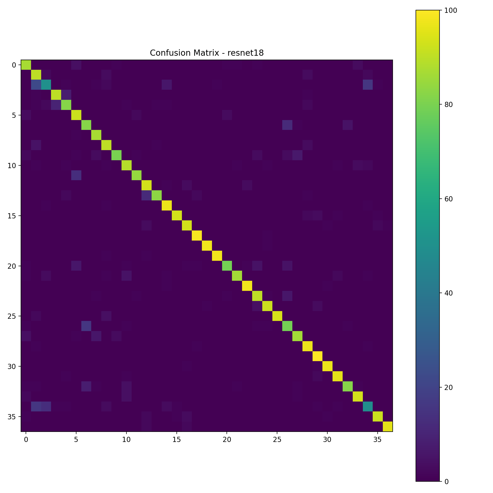
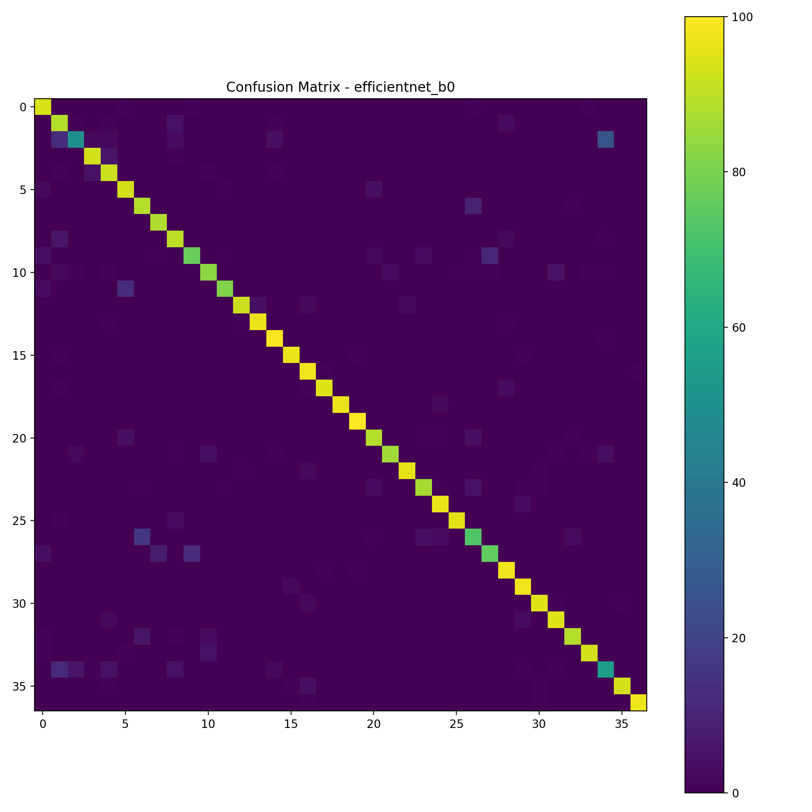
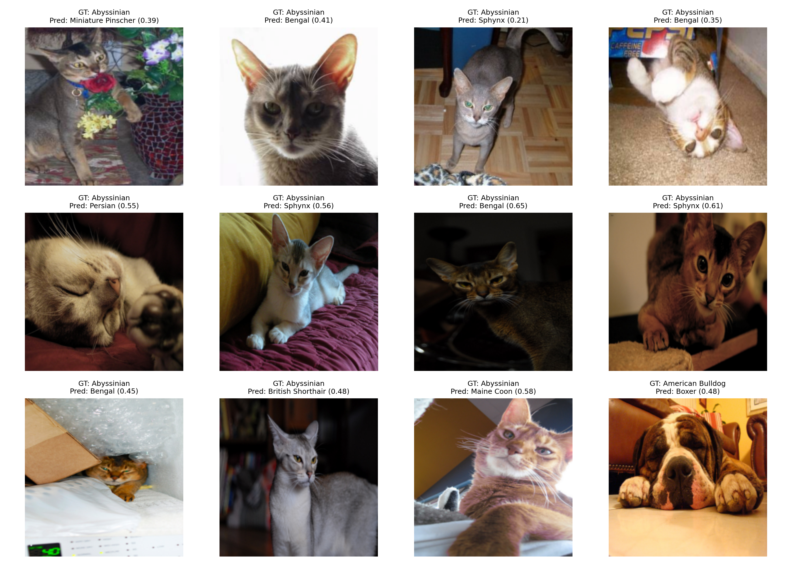
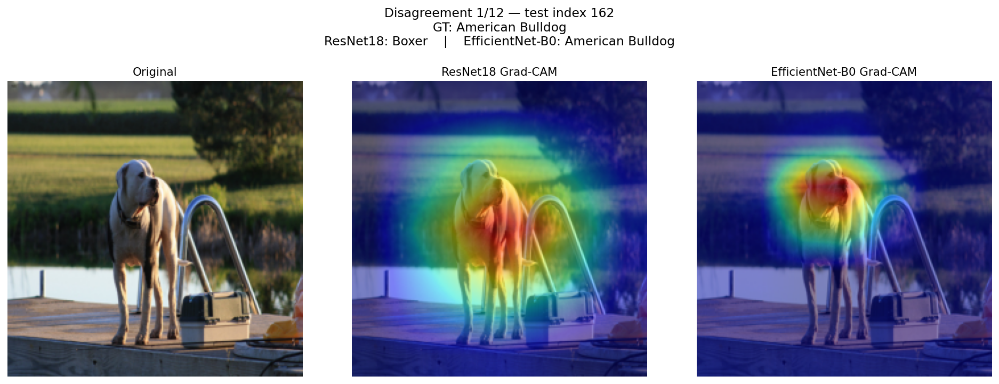
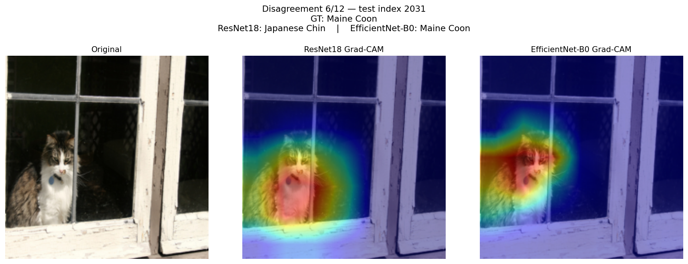
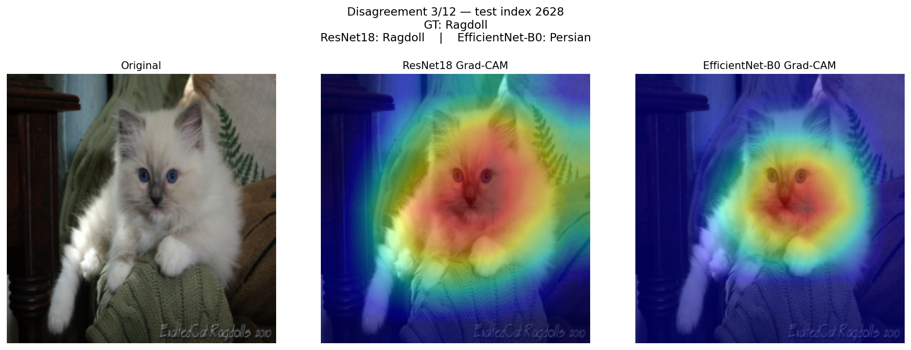
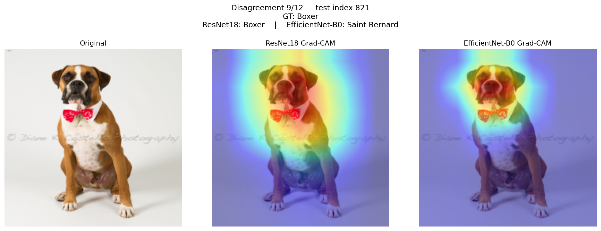
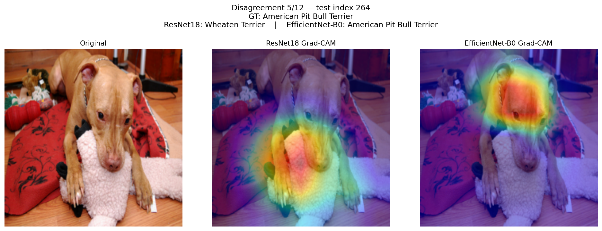
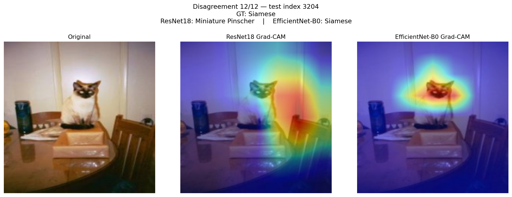
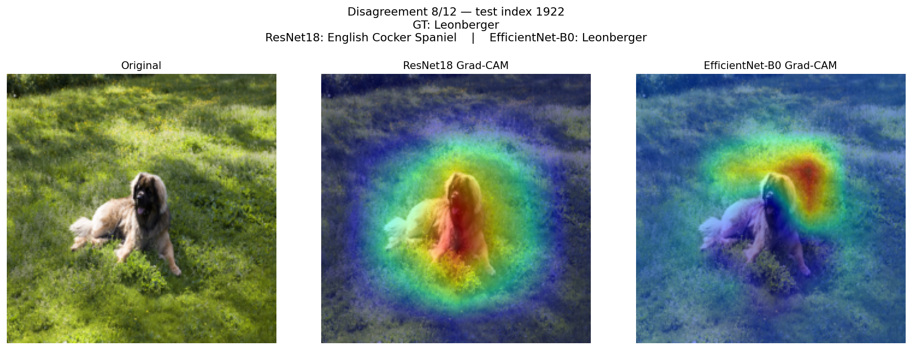

# 🐶🐱 CNN Pet Breed Classification with Interpretability

A reproducible deep learning project comparing modern convolutional neural networks for fine-grained pet breed recognition, with a strong emphasis on **model behaviour, failure modes, and interpretability** rather than raw accuracy alone.

The project trains and evaluates:

- **ResNet-18** — robust residual baseline  
- **EfficientNet-B0** — parameter-efficient modern architecture with squeeze-and-excitation attention  

We then analyse:

✅ per-class performance  
✅ systematic confusions  
✅ where models disagree  
✅ what visual evidence each model uses (Grad-CAM)

---

## 🚀 Results Overview

| Model | Test Macro F1 |
|------|------|
| ResNet-18 | **0.887** |
| EfficientNet-B0 | **0.900** |

EfficientNet achieves a modest but consistent improvement, which we investigate through disagreement analysis and saliency mapping.

---

## 🧠 Why this project matters

Fine-grained visual recognition problems (e.g. dog breeds) require sensitivity to:

- facial structure  
- ear geometry  
- fur texture  
- colour patterns  

Small architectural differences can significantly change **what evidence a model relies on**.

Understanding *why* predictions are made is essential for trust, debugging, and deployment.

---

## 🧱 Models

### ResNet-18
A classic residual network with skip connections enabling stable optimisation.

### EfficientNet-B0
Uses compound scaling and channel attention to maximise accuracy per parameter, often producing more concentrated feature usage.

---

## 📊 Confusion Structure

### ResNet-18


### EfficientNet-B0


Both models show strong diagonals, indicating high accuracy.

Errors cluster between **visually similar breeds**, such as:

- American Pit Bull Terrier ↔ American Bulldog  
- Ragdoll ↔ Birman  
- Beagle ↔ Basset Hound  

This suggests ambiguity inherent to the data rather than arbitrary mistakes.

---

## 🔎 Example Predictions

### EfficientNet – incorrect cases


### ResNet – incorrect cases



## 🔥 Disagreement Analysis

Out of ~3,700 test images, the models disagree on ~9%.

This small subset reveals **where architectural inductive biases differ**.


## 🔬 Disagreement Case Studies & Interpretability Themes

Rather than showing a single qualitative example, we group disagreements into recurring behavioural patterns.  
These highlight **how architectural bias influences the visual evidence each model relies upon**.


### 📌 Theme 1 — EfficientNet better isolates the subject

In many disagreements, EfficientNet concentrates saliency on anatomically meaningful regions (face, ears, fur texture), while ResNet distributes attention more diffusely or drifts toward background context.

This tighter localisation frequently coincides with correct predictions.

**Representative examples:**

#### Example 1


#### Example 6


In these cases, EfficientNet locks onto the animal’s defining morphology, whereas ResNet’s broader attention leads to confusion.

**Interpretation:**  
EfficientNet appears to develop more discriminative, object-centric representations.

---

### 📌 Theme 2 — Wider context can sometimes help (ResNet advantage)

However, there are counterexamples where EfficientNet’s focus is too narrow.  
By emphasising only a small facial region, it may ignore global body proportions that are informative for breed identity.

ResNet’s broader receptive behaviour can therefore be beneficial.

**Representative examples:**

#### Example 3


#### Example 9


**Interpretation:**  
While localisation is powerful, excessive narrowing can discard useful structural information.

This demonstrates complementary strengths rather than a strictly superior model.

---

### 📌 Theme 3 — Spurious correlations & background bias

Some errors are highly revealing: the incorrect model attends strongly to objects or scenery rather than the animal itself.

This provides direct diagnostic evidence of *why* the prediction failed.

**Representative examples:**

#### Example 5 — toy distraction


#### Example 12


**Interpretation:**  
Attention allocated to non-animal regions suggests partial reliance on contextual shortcuts instead of intrinsic breed features.

This is precisely where explainability tools become valuable for debugging.

---

### 📌 Theme 4 — Correct prediction despite unintuitive attention

Attention maps are not always aligned with human expectation.

In some cases EfficientNet attends to background regions yet still predicts correctly.

**Representative example:**

#### Example 8


**Interpretation:**  
Grad-CAM visualises correlated evidence, not a full causal reasoning chain.  
Models may encode distributed or subtle cues invisible in the heatmap.

---

## 🧠 Overall takeaway from disagreements

Across themes we observe:

- EfficientNet generally produces **sharper, object-focused saliency**
- ResNet sometimes leverages **global spatial structure**
- Both models exhibit occasional background reliance
- The diversity of behaviour indicates potential gains from **ensembling**

This analysis moves beyond accuracy reporting toward understanding **how neural networks actually make decisions**.

---

## 🎯 Interpretability Insights

Across sampled disagreements:

### EfficientNet tends to:
✔ localise tightly on discriminative anatomy  
✔ ignore background clutter  
✔ achieve slightly better macro F1  

### ResNet sometimes:
⚠️ relies on global or contextual cues  
⚠️ may attend to accessories or scenery  
⚠️ but can capture body proportions EfficientNet misses  

### Important caveat:
Grad-CAM highlights correlated evidence, not full causal reasoning.  
Correct predictions can still occur even when attention seems unintuitive.

---


## 🛠 Reproducibility

Train:
```bash
python -m src.train --model resnet18
python -m src.train --model efficientnet_b0
```

Evaluate:
```bash
python -m src.evaluate --model resnet18
python -m src.evaluate --model efficientnet_b0
```

Compare + Grad-CAM:
```bash
python -m src.compare_models
```

Outputs are written to:
```
outputs/
```

---

## 📁 Repository Structure

```
src/
    train.py
    evaluate.py
    compare_models.py
notebooks/
    Outputs.ipynb
outputs/
Images/  # small curated visuals for README
```


## 👤 Author

Kieran Satheesan  
Physics BSc — Machine Learning & AI focus  
